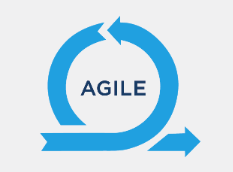

<a href="/README.md">вернуться к оглавлению</a>

<b>AGILE</b>  

**Предистория**  
В феврале 2001 года 17 разработчиков, обеспокоенных состоянием IT‑индустрии,  
опубликовали короткий манифест, призванный помочь заказчикам, руководителям и  
исполнителям договариваться друг с другом. 4 ценности и 12 принципов Agile  
уместились в 254 слова. 

<b>ЧТО ТАКОЕ AGILE</b> 
Agile — подход к управлению проектами и разработке программного обеспечения,  
который помогает быстрее создавать качественные продукты и правильно развивать их.  
Такой результат становится возможным благодаря гибкости рабочих процессов  
и эффективному взаимодействию всех заинтересованных лиц:  
клиентов, заказчиков и команды проекта.  

<b>ЦЕННОСТИ AGILE</b> 
~ **Люди и взаимодействие важнее процессов и инструментов.** 
Если вы хотите построить гибкий процесс, вам нужно взаимодействовать и общаться   
между собой. При этом вы можете (и обязательно будете) использовать какие-то  
инструменты и процессы, например, трекеры — JIRA, Redmine и т.д. Но ваша работа  
должна опираться на различные митинги, встречи и взаимодействие, а не на настройки  
трекеров или TFS (если говорить про Microsoft стэк).  

~ **Работающий продукт важнее исчерпывающей документации.**  
Предположим есть 2 компании: у одной имеется готовый продукт, который можно дать   
пользователям, заказчику, захватив рынок; а вторая пишет ТЗ, рисует макеты и т.д.  
Вся эта документация, которую пользователь не может применить по причине   
не готовности продукта, не приносит ценности этому пользователю. Если мы научимся   
работать, минимизируя эти шаги, либо делая их небольшими кусочками,   
то у нас получится более гибкий процесс.  

~ **Сотрудничество с заказчиком важнее согласования условий контракта.**  
Сотрудничество и взаимодействие с заказчиком важнее жестких контрактных ограничений.   
Обычно подписывается договор, в котором указано, что к конкретной дате за определенную   
сумму разработчик обязуется выполнить оговоренный объем работ. Естественно, к договору   
прикладывается ТЗ. То есть фиксируется время, объем работ и сроки.   
Это называется Fixed Price. Такой подход не очень хорош, если вы хотите работать   
на долгосрочную перспективу и быть гибкими. В этом случае правильнее выстраивать   
партнерские отношения с заказчиком. Если говорить про контрактные оформления,   
то обычно это выливается в контракты по схеме «время — материалы»,   
когда разработчику просто оплачивается потраченное время. Самое главное, что здесь   
начинается поиск партнерства и ситуации Win-Win, когда побеждает и заказчик,   
и его подрядчик.    

~ **Готовность к изменениям важнее следования первоначальному плану.**  
В Agile есть план, оценки и прогнозы. Но если у вас есть какой-то первоначальный   
план для годового проекта, а вы через три месяца уже предоставили какую-то версию  
продукта, пользователи его пощупали, вы сняли метрики, посмотрели, что и как  
они используют, узнали что-то новое, то после этого первоначальный  
план можно почти полностью поменять.  

<b>ОСНОВНЫЕ ПРИНЦИПЫ</b> 
~ **Наивысшим приоритетом для нас является удовлетворение потребностей заказчика,**  
**благодаря регулярной и ранней поставке ценного программного обеспечения.** 
Если заказчик хочет получить от нас большого слона, но мы можем дать ему часть  
этого слона не через год, а через три месяца, потом еще через три месяца еще одну  
часть, а затее ежемесячно выдавать кусочки, то чем чаще мы это будем  
делать и чем раньше, тем лучше.  

~ **Изменение требований приветствуется даже на поздних стадиях разработки.**  
**Agile-процессы позволяют использовать изменения для обеспечения заказчику**   
**конкурентного преимущества.** 
Мы всегда готовы изменять требования, даже на поздних стадиях проекта,   
если узнаем что-то новое. Таким образом, мы создаем бизнесу или внешнему заказчику   
конкурентное преимущество. Допустим, работают две компании: одна написала ТЗ и за  
год сделала продукт, а мы сделали концепцию продукта (неважно, в каком виде)  
и постепенно его выкатываем и раскатываем. Тогда наш продукт будет  
больше соответствовать требованиям заказчиков, пользователей и рынка в целом.   

~ **Работающий продукт следует выпускать как можно чаще,**   
**с периодичностью от пары недель до пары месяцев.**  
На самом деле это неделя/месяц, если вы используете Scrum. В России чаще всего   
каждые две недели выпускается что-то новое. А если делают какой-то веб-проект,  
то обычно используют одну из вариаций Kanban, значит, релизы можно делать каждый  
день.   

~ **На протяжении всего проекта разработчики и представители бизнеса должны**   
**ежедневно работать вместе.**  
Бизнес обязательно должен работать вместе с программистами, помогать им понять   
специфику данного рынка. Например, программисты, которые работают с HR должны понимать,  
как работает HR, и как соискатели ищут работу. Если вы работаете в банке, то вам  
требуется понимание принципа работы банка в целом и очень подробные сведения о той  
сфере, за которую вы отвечаете. Наиболее частой проблемой, является недоступность  
бизнеса — когда разработчик не может получить у сотрудника нужную информацию.   
При использовании Agile важно избегать возникновения подобных ситуаций.   

~ **Над проектом должны работать мотивированные профессионалы. Чтобы работа была**   
**сделана, создайте условия, обеспечьте поддержку и полностью доверьтесь им.**  
Команда — один из краеугольных камней Agile. Наилучших результатов достигает  
команда замотивированных профессионалов. Есть гениальное замечание о том,  
что эффективность Scrum зависит от руководителя. В Agile руководитель прежде  
всего должен создавать условия для команды и обеспечивать всестороннюю поддержку,  
проводить коучинг, следить за атмосферой в коллективе.  

~ **Непосредственное общение является наиболее практичным и эффективным способом**  
**обмена информацией как с самой командой, так и внутри команды.**  
Есть много исследований, которые показывают, что лучшее общение — лицом к лицу.   
Причем желательно, чтобы было какое-то средство визуализации, на котором можно писать:  
лист бумаги, доска со стикерами и т.д. Самый простой и эффективный способ узнать  
требования клиента, заказчика или пользователя — поговорить с ними.  

~ **Работающий продукт — основной показатель прогресса.**  
Степень готовности проекта должна измеряться не словами, о том, что ТЗ уже написано  
и 50% макетов нарисовано, а количеством функционала, выпущенного в production.  

~ **Инвесторы, разработчики и пользователи должны иметь возможность поддерживать**   
**текущий темп бесконечно. Agile помогает наладить такой устойчивый процесс разработки.**  
В Agile важен ритм, постоянные улучшения. Бизнес и программисты всегда должны иметь  
возможность делать процесс устойчивым, постоянно его улучшать.  

~ **Постоянное внимание к техническому совершенству и качеству**   
**проектирования повышает гибкость проекта.**  
Про этот пункт менеджеры обычно не любят говорить разработчикам, но Agile вообще  
не будет работать, если вы написали быдло-код. У вас должна быть хорошая гибкая  
архитектура, в которую можно добавлять разные элементы и при необходимости легко  
их изменять. И если команда не будет уделять максимум внимания техническому качеству  
(писать хороший код, использовать инженерные практики, автоматизировать процессы),  
то никакого Agile у вас не будет.  

~ **Простота — искусство минимизации лишней работы — крайне необходима.** 
Простота. Она проявляется в технической составляющей, в дизайне. Это один из   
принципов экстремального программирования. Простота очень важна также с точки  
зрения выпуска продукта: когда вы хотите "нарезать" того "слона", лучше начать  
с простой части. 

~ **Самые лучшие требования, архитектурные и технические решения рождаются у**   
**самоорганизующихся команд.**  
Менеджер (руководитель, Scrum-коуч, Agile-коуч) в команде меняет свою роль: он не  
столько занимается организацией процесса, сколько учит команду, поэтому команда  
должна быть самоорганизованной. Есть специальные стратегии, как из группы людей  
сделать самоорганизованную команду.  

~ **Команда должна систематически анализировать возможные способы улучшения**  
**эффективности и соответственно корректировать стиль своей работы.**  

**В каких случаях рекомендуется применять Agile** 
~ Когда потребности пользователей постоянно меняются в динамическом бизнесе. 
~ Изменения на Agile реализуются за меньшую цену из-за частых инкрементов. 
~ В отличие от модели водопада, в гибкой модели для старта проекта  
достаточно лишь небольшого планирования.  

**Сильные стороны Agile** 
Почему Agile пользуется такой популярностью и среди менеджеров, и среди  
исполнителей? Потому что этот подход полезен всем участникам рабочего процесса: 
~ Вся команда может свободно принимать решения во всём, что касается проекта:   
выбирать технологии, архитектурные решения, подходы и практики. 
~ Каждый разработчик получает возможность работать с интересными ему   
технологиями и влиять на продукт, а значит, ощущать смысл своей работы  
и собственную ценность для команды. 
~ Бизнес получает актуальный продукт, соответствующий потребностям пользователей.   
Сотрудникам комфортно и интересно работать, рабочие процессы подвижные и гибкие. 
~ Пользователь получает по‑настоящему полезный продукт, на развитие которого  
он может влиять. Продукт своевременно обновляется: появляются новые функциональности,   
устраняются ошибки.  
~ Все в плюсе: проект завершается появлением качественного продукта,   
в который легко вносить изменения. Клиентам приятно им пользоваться,  
команда создателей мотивирована продолжать работу.  

**Сложности при применении Agile** 
~ Проект становится менее предсказуемым. Из‑за этого порой сложно правильно  
оценить сроки выполнения задач и ресурсы, которые придётся задействовать.  
~ Взаимодействие с клиентами и коммуникация внутри команды будут занимать  
гораздо больше времени, чем до Agile. Оперативно тестировать и согласовывать  
результаты можно лишь в том случае, когда все на связи. 
~ Готовить документацию станет сложнее из‑за того, что в парадигме Agile  
проект и требования к нему меняются в процессе работы над продуктом. Если вы  
захотите подключить новых сотрудников в середине работы над проектом,  
ввести их в курс дела может быть непросто. 
~ Проект легко может свернуть не туда, поскольку Agile не предполагает  
тщательного планирования перед началом работы и подразумевает изменение  
требований к продукту в процессе его создания. Чтобы избежать этого,  
важно выстроить однозначную и регулярную коммуникацию с заказчиком. Полностью  
исключить недопонимания едва ли получится, но их количество можно минимизировать.  