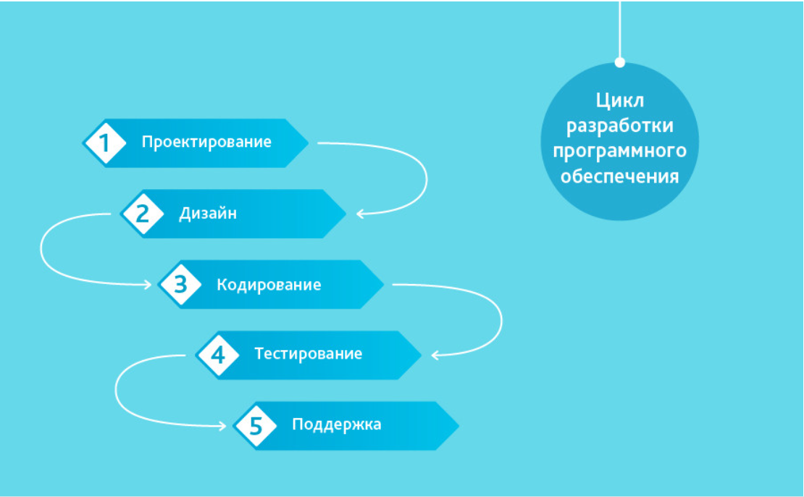
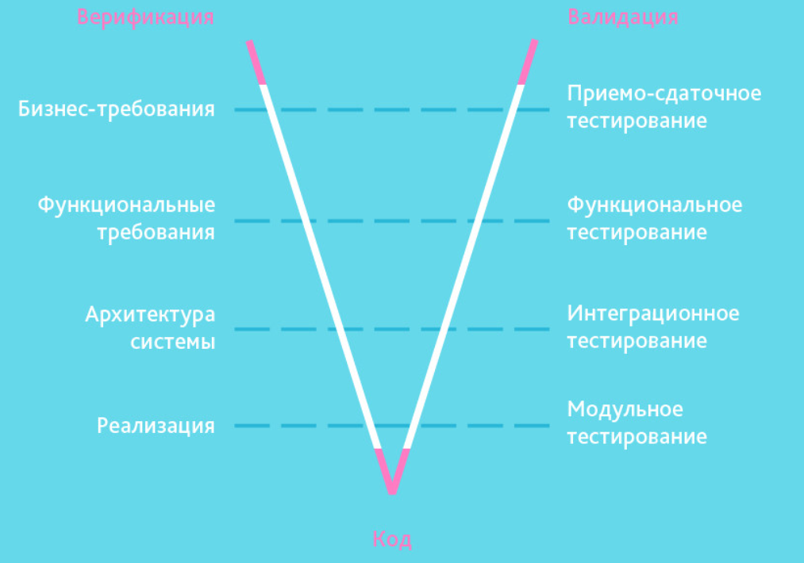
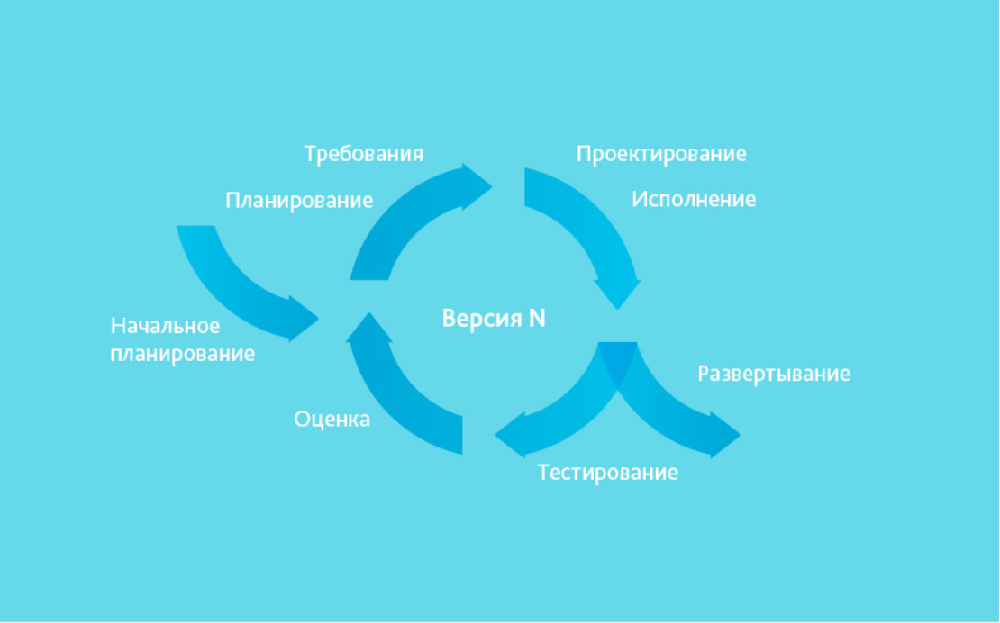
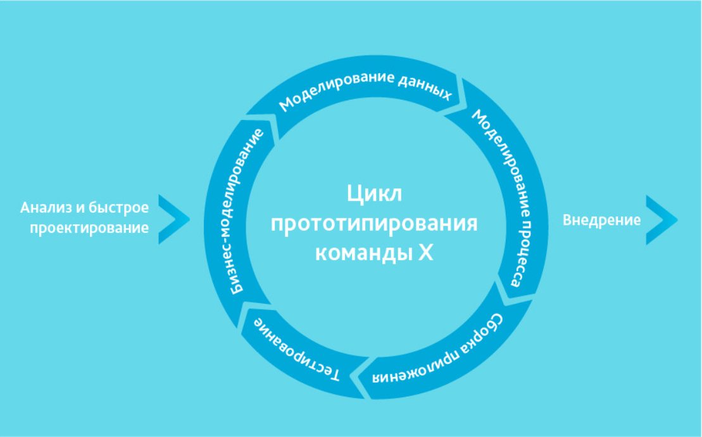
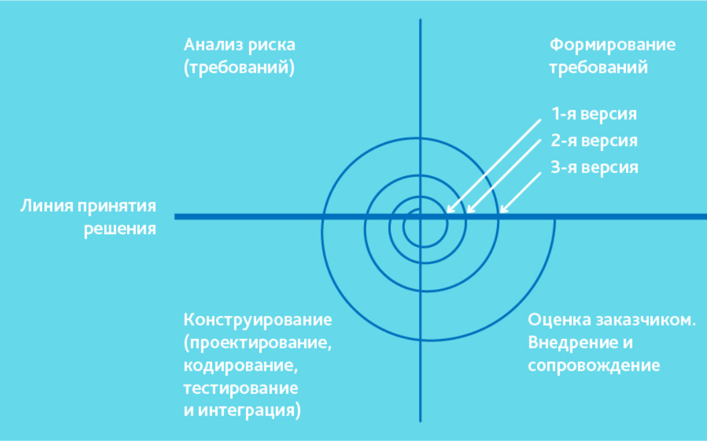

<a href="/README.md">вернуться к оглавлению</a>

<b>МЕТОДОЛОГИИ, КОТОРЫЕ ИСПОЛЬЗОВАЛИСЬ ДО AGILE</b>  
(кратко)  

До того, как Agile начала все больше и больше захватвывала рынок использовались 
другие методологии.

**"Waterfall Model" (каскадная модель или "водопад")** 

Скрин Waterfall

  

Одна из самых старых, подразумевает последовательное прохождение стадий, каждая  
из которых должна завершиться полностью до начала следующей. В модели Waterfall  
легко управлять проектом. Благодаря её жесткости, разработка проходит быстро,  
стоимость и срок заранее определены. Но это палка о двух концах. Каскадная модель  
будет давать отличный результат только в проектах с четко и заранее определенными  
требованиями и способами их реализации. Нет возможности сделать шаг назад, тестирование   
начинается только после того, как разработка завершена или почти завершена. Продукты,  
разработанные по данной модели без обоснованного ее выбора, могут иметь недочеты  
(список требований нельзя скорректировать в любой момент), о которых становится  
известно лишь в конце из-за строгой последовательности действий. Стоимость внесения  
изменений высока, так как для ее инициализации приходится ждать завершения всего проекта.   
Тем не менее, фиксированная стоимость часто перевешивает минусы подхода. Исправление  
осознанных в процессе создания недостатков возможно, может поребовать несколько дополнительных   
соглашений к контракту. 
<b>Когда использовать каскадную методологию?</b> 
~ Только тогда, когда требования известны, понятны и зафиксированы. Противоречивых 
требований не имеется.  
~ Нет проблем с доступностью программистов нужной квалификации. 
~ В относительно небольших проектах.  

<b>V-Model</b>  

Скрин V-model

  
Унаследовала структуру "шаг за шагом" от каскадной модели. V-образная модель  
применима к системам, которым особенно важно бесперебойное функционирование.  
Например, прикладные программы в клиниках для наблюдения за пациентами,  
интегрированное ПО для механизмов управления аварийными подушками безопасности   
в транспортных средствах и так далее. Особенностью модели можно считать то,  
что она направлена на тщательную проверку и тестирование продукта,  
находящегося уже на первоначальных стадиях проектирования. Стадия тестирования   
проводится одновременно с соответствующей стадией разработки, например,  
во время кодирования пишутся модульные тесты. 
<b>Когда использовать V-модель?</b> 
~ Если требуется тщательное тестирование продукта, то V-модель оправдает заложенную  
в себя идею: <b>validation</b> and <b>verification</b>.  
~ Для малых и средних проектов, где требования четко определены и фиксированы.  
~ В условиях доступности инженеров необходимой квалификации, особенно тестировщиков.   

<b>Incremental Model (инкрементная модель)</b>  

Скрин Incremental Model

  
В инкрементной модели полные требования к системе делятся на различные сборки.  
Терминология часто используется для описания поэтапной сборки ПО. Имеют место   
несколько циклов разработки, и вместе они составляют жизненный цикл "мульти-водопад".   
Цикл разделен на более мелкие легко создаваемые модули. Каждый модуль проходит через  
фазы определения требований, проектирования, кодирования, внедрения и тестирования.  
Процедура разработки по инкрементной модели предполагает выпуск на первом большом  
этапе продукта в базовой функциональности, а затем уже последовательное добавление  
новых функций, так называемых «инкрементов». Процесс продолжается до тех пор,  
пока не будет создана полная система. Инкрементные модели используются там,  
где отдельные запросы на изменение ясны, могут быть легко формализованы и реализованы.  
<b>Когда использовать инкрементную модель?</b> 
~ Когда основные требования к системе четко определены и понятны. В то же время некоторые  
детали могут дорабатываться с течением времени. 
~ Требуется ранний вывод продукта на рынок. 
~ Есть несколько рисковых фич или целей.  

<b>RAD Model</b>  
(rapid application development model или быстрая разработка приложений)  

Скрин RAD Model

  
RAD-модель — разновидность инкрементной модели. В RAD-модели компоненты или  
функции разрабатываются несколькими высококвалифицированными командами параллельно,   
будто несколько мини-проектов. Временные рамки одного цикла жестко ограничены.  
Созданные модули затем интегрируются в один рабочий прототип. Синергия позволяет  
очень быстро предоставить клиенту для обозрения что-то рабочее с целью получения  
обратной связи и внесения изменений. 
<b>Модель быстрой разработки приложений включает следующие фазы:</b> 
~ Бизнес-моделирование: определение списка информационных потоков между  
различными подразделениями. 
~ Моделирование данных: информация, собранная на предыдущем этапе, используется  
для определения объектов и иных сущностей, необходимых для циркуляции информации. 
~ Моделирование процесса: информационные потоки связывают объекты для достижения  
целей разработки. 
~ Сборка приложения: используются средства автоматической сборки для преобразования   
моделей системы автоматического проектирования в код.  
~ Тестирование: тестируются новые компоненты и интерфейсы. 
<b>Когда используется RAD-модель?</b> 
Может использоваться только при наличии высококвалифицированных и узкоспециализированных  
архитекторов. Бюджет проекта большой, чтобы оплатить этих специалистов вместе со стоимостью  
готовых инструментов автоматизированной сборки. RAD-модель может быть выбрана при уверенном  
знании целевого бизнеса и необходимости срочного производства системы в течение 2-3 месяцев.  

<b>Iterative Model (итеративная или итерационная модель)</b>  

Скрин Iterative Model

  
Итерационная модель жизненного цикла не требует для начала полной спецификации   
требований. Вместо этого, создание начинается с реализации части функционала,  
становящейся базой для определения дальнейших требований. Этот процесс повторяется.   
Версия может быть неидеальна, главное, чтобы она работала. Понимая конечную цель,  
мы стремимся к ней так, чтобы каждый шаг был результативен, а каждая версия  
— работоспособна. 
На диаграмме показана итерационная "разработка" Мона Лизы. Как видно, в первой  
итерации есть лишь набросок Джоконды, во второй — появляются цвета,  
а третья итерация добавляет деталей, насыщенности и завершает процесс.  
В инкрементной же модели функционал продукта наращивается по кусочкам,  
продукт составляется из частей. В отличие от итерационной модели, каждый кусочек  
представляет собой целостный элемент. 
<b>Когда оптимально использовать итеративную модель?</b> 
~ Требования к конечной системе заранее четко определены и понятны. 
~ Проект большой или очень большой. 
~ Основная задача должна быть определена, но детали реализации могут  
эволюционировать с течением времени.  

<b>Spiral Model (спиральная модель)</b>  

Скрин Spiral Model

  
Спиральная модель похожа на инкрементную, но с акцентом на анализ рисков. Она  
хорошо работает для решения критически важных бизнес-задач, когда неудача несовместима  
с деятельностью компании, в условиях выпуска новых продуктовых линеек, при необходимости  
научных исследований и практической апробации. 
<b>Спиральная модель предполагает 4 этапа для каждого витка:</b> 
~ планирование; 
~ анализ рисков; 
~ конструирование; 
~ оценка результата и при удовлетворительном качестве переход к новому витку. 
Эта модель не подойдет для малых проектов, она резонна для сложных и дорогих,  
например, таких, как разработка системы документооборота для банка, когда каждый  
следующий шаг требует большего анализа для оценки последствий, чем программирование.  