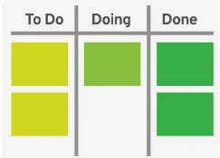
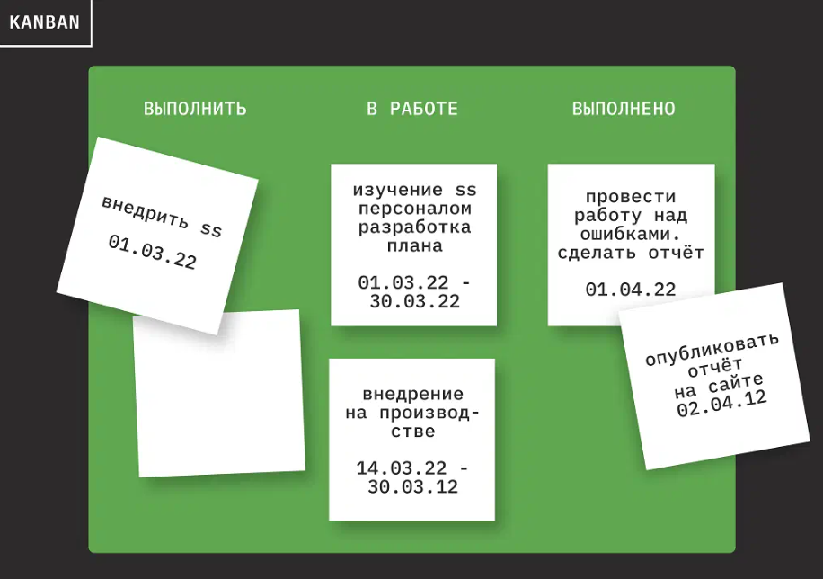

<a href="/README.md">вернуться к оглавлению</a>

<b>KANBAN </b>  
**Kanban** — способ управления процессом, который предполагает визуализацию цели,  
задач и прогресса. Kanban имеет большой набор инструментов. Один из этих  
инструментов — вытягивающая система задач канбан, которую часто визуализируют   
с помощью карточек. Рабочие задачи представлены карточками на Kanban‑доске  
и по мере выполнения перемещаются от одной стадии рабочего процесса к другой.  
Рабочий процесс получается непрерывным, но при этом у команды есть определённая  
свобода действий и возможность менять приоритеты в зависимости от изменения ситуации.  

<b>Советы по работе с Kanban</b>  

Скрин Kanban пример

 
Многие компании сейчас используют инструмент этой методологии - Kanban-доску,  
например Trello. Но на самом деле сама методология гораздо шире. Работа над  
проектом в ней состоит из нескольких принципов: 
~ Визуализируйте все задачи на специальной Kanban-доске. Если появляется   
новая задача — сразу добавляйте на доску. 
~ Ограничьте количество работы в процессе — в каждом столбике доски должно   
быть не больше определённого количества задач. 
~ Управляйте потоком работы — отслеживайте, как задачи движутся по доске. 
~ Используйте только явные правила добавления и движения задач, понятные  
всем участникам. 
~ Вводите петли обратной связи — наборы встреч, помогающие лучше понимать 
процесс работы. 
~ Улучшайте процессы везде, где это возможно. 
Kanban гораздо мягче, чем Scrum. Он позволяет начать с того, что есть сейчас:  
взять принципы, уже присутствующие в компании, и постепенно их улучшать.  
Теоретически его можно совместить даже с другими методологиями,  
например с Waterfall. 
Но нужно понимать, что сделать доску и вывесить на неё задачи — ещё не Kanban.   
Остальные принципы тоже нужно соблюдать, чтобы от методологии была реальная польза. 
Недостаток Kanban в том, что он плохо согласуется с квартальным планированием.  
Задачи в нём выполняются единым потоком, и сложно назначить конкретные сроки  
и предоставлять чёткие результаты и отчёты. Требуются отдельные усилия  
менеджера команды.  

<b>Итерации</b>  
Итераций нет, поток задач разбирают разработчики. Важно, чтобы этот поток   
не прерывался и был быстрым. Основной фокус руководителя Kanban-команды —  
на препятствиях и заторах, которые возникают и мешают команде быстро  
закрывать задачи  

<b>Взаимодействия в команде</b> 
Регулярные совещания не обязательны: команда может встречаться, только   
если это необходимо. 

<b>Роли в команде</b> 
Чёткого распределения ролей не требуется: ещё одна причина, по которой  
этот метод больше подходит узкопрофильным Agile-командам. 