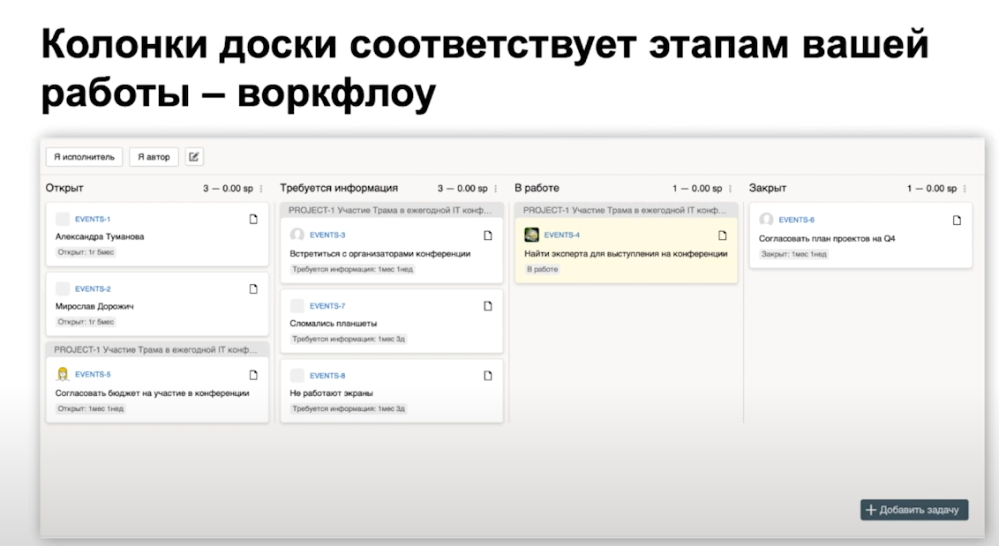

<a href="/README.md">вернуться к оглавлению</a>

<b>Небольшая история появления Scrum</b>  
**Scrum‑фреймворк** изобрели Кен Швабер и Джефф Сазерленд, которые подсмотрели  
за работой американских военных и пришли к выводу, что основа успеха  
заключается в качественном командном взаимодействии. Сам термин позаимствован  
у регбистов и в переводе с английского означает "схватка". Кстати, пусть  
Scrum зародился в мире разработки ПО, сейчас используется в разных сферах  
бизнеса. Например, с помощью фреймворка повышают эффективность работы  
промышленного производства, чаще применяя прототипирование модулей,  
синхронизируя работу подразделений и стараясь получать обратную связь  
по каждой произведённой партии продукции.  

<b>SCRUM</b>  
Чаще всего Scrum используют для управления универсальными командами: 
он требует существенного изменения рабочих процессов, включает больше  
ограничений и правил, но помогает командам стать самостоятельнее.  
Подойдёт для запуска новых продуктов. 
**Scrum** — это фактически инструкция по организации итеративно‑инкрементальной  
разработки нового продукта, которого ещё не было на рынке.  
Здесь нет лишних «деталей», всё взаимосвязано. 
**Scrum** — это фреймворк, в основе которого лежат короткие итерации  
длительностью 2–3 недели, их называют "спринты". Перед началом каждого спринта   
команда формирует список задач, которые должны быть выполнены к концу периода.  
Каждый раз по завершении спринта команда проводит <b>Sprint Retrospective</b> —  
анализирует ситуацию для повышения эффективности и в том числе решает,  
нужно ли включать незавершённые задачи в следующий спринт.  
В процессе работы над задачами спринта команда постоянно синхронизируется   
на ежедневных встречах, на которых фиксируют текущий статус в виде ответов  
каждого участника.  

<b>Как работают по Scrum</b>  

Скрин Scrum

   
Сначала владелец продукта, обычно заказчик, формирует набор требований к продукту.  
Он передаёт его разработчикам. Те делят работу на этапы - спринты, обычно длиной  
от одной до четырёх недель. За один спринт команда выполняет конкретный пласт работ,  
который приводит к результату - цели спринта. Работы берутся из бэклога проекта -  
списка этапов, которые необходимо выполнить. На его основе составляют бэклог спринта. 
В идеале цель спринта должна быть атомарной, то есть на выходе нужен готовый к  
использованию продукт. После спринта проходит обзор и ретроспектива,  
при необходимости пересматриваются задачи, а потом формируется  
бэклог для нового спринта. 
Выполнять задачи и не отклоняться от цели помогают события: ежедневные синки,  
приоритизация, работа с бэклогом, планирование. За всем этим следит scrum-мастер —   
он помогает команде договариваться и планировать. Подробно все это описано в  
Scrum-гайде — главном документе методологии. 
<code> scrumguides.org/docs/scrumguide/v2017/2017-Scrum-Guide-Russian.pdf</code>  
Scrum хорошо работает в условиях неопределённости, но требует отсутствия внешних   
зависимостей. Вы должны полностью сами управлять спринтом — как только появляется  
другая команда, которая может повлиять на результат, всё ломается. 
В отличие от многих других гибких методологий семейства Agile, Scrum дружит с   
квартальным планированием и отчётами. Он позволяет обещать бизнесу  
конкретные результаты в чёткие сроки. 
Большинство команд берут отдельные принципы Scrum, хотя редко используют его  
целиком. Здесь кроется проблема — легко упустить важное, что-то сломать и потом  
думать, что Scrum не работает целиком. Хотя на самом деле причина в том, что не  
хватило какого-то конкретного инструмента или принципа. Поэтому важно тестировать  
разные комбинации подходов и примерять их к своему бизнесу.  

<b>Итерации</b>  
Итерации называются спринтами, это временные промежутки одинаковой длительности 
(чаще всего от 1 до 4 недель)  

<b>Взаимодействия в команде</b> 
Требует совещаний: самоорганизованной команде нужно регулярно синхронизировать  
рабочие процессы.  

<b>Роли в команде</b> 
Есть чёткое разделение по ролям. Управление и соблюдение принципов гибкого   
управления проектам контролирует Scrum-мастер.  

<b>Разбиение на  задачи</b> 

Скрин Разбиение на задачи

 
~ Эпик - есть какойто-то общий проект, который делится на: 
~ Пользовательские истории, которые в свою очередь делятся на: 
~ Направления разработки(например, фронт, бек, тест и т.д.)  
которые делятся на: 
~ Задачи и подзадачи нужного размера.  

<b>Приоритеты выполнения задач</b> 

Скрин Расстановка приоритетов

 
После деления на задачи, всем задачам раздается приоритет: 
~ Блокер - задача, которыя может заблокировать выполнение  
всех остальных задач; 
~ Далее по нисходящей по важности или другим параметрам  

<b>Оценка задач</b> 

Скрин Пример Story Points

 
Story Points - условные единицы сложности задач 
Чаще всего оценка задач в Scrum происходит <b>в часах</b>. Но иногда используются  
<b>Story Points (SP)</b>, которые отражают сложность работы. Спринт формируется   
исходя из оценки всех задач. К концу периода становится ясно, сколько часов   
на самом деле отработала команда или сколько SP она выполнила. Объём работы,   
которую команда  может выполнить за спринт, получил название <b>Velocity</b>.   

<b>Poker - один из способов оценки задач</b> 

Скрин Пример Poker

 
Способ заключается в том, что для некоторых задач каждый из членов команды дает  
свою оценку времени выполнения задачи, а потом выбирая один из алгоритмов расчетов, 
(например по среднему или минимум, или как-то ещё) и этой задаче  
расчитывается время выполнения.  

<b>Workflow - рабочий процесс</b> 

Скрин Workflow

 
Колонки вашей доски соотвествуют этапам вашей работы - workflow  

Статусы и переходы

 
Каждое задание в рабочем процессе имеет свой статус и возможность  
перехода на другой этап.  
