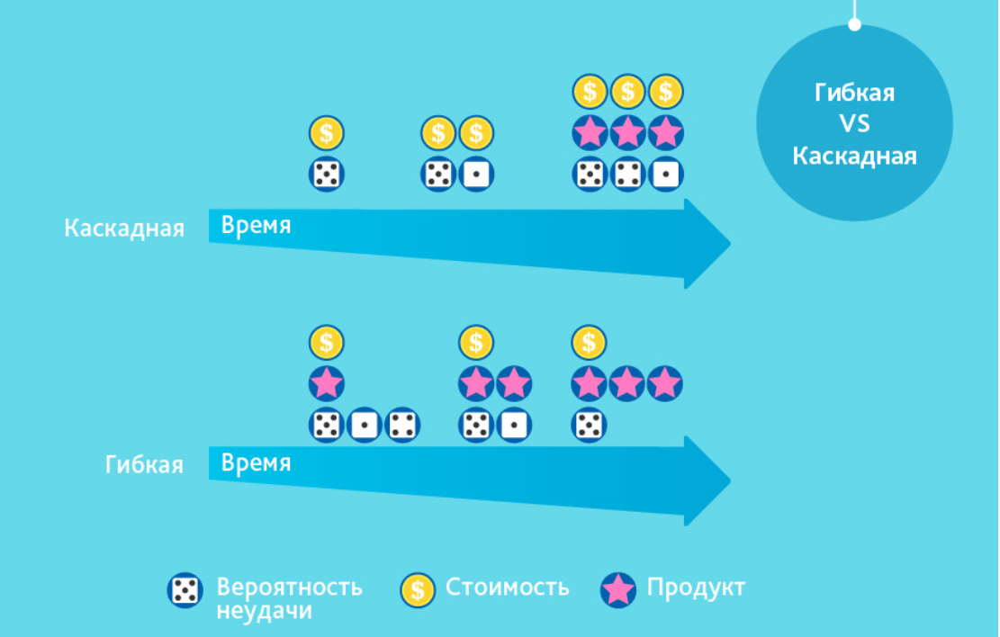

<h3>Agile - гибкая методология разработки программ</h3>
Описание проекта: работаем с Agile, Scrum, Kanban 

Примечание: информация о проекте

Большая часть информации о проекте: примечания, описания, объяснения, картинки,  
комментарии находятся в папке <b><a href="01_info">01_info</a></b>. 

  

<a href="/01_info/before/BEFORE.md">Методологии до Agile</a>  
Методологии которые использовались, пока Agile не захватила большую часть рынка 
Waterfall Model, V-Model, Incremental Model, RAD Model, Iterative Model, Spiral Model  

**Гибкие методики разработки** (англ. agile software development, agile-разработка) -  
обобщающий термин для целого ряда подходов и практик, основанных на ценностях Манифеста  
гибкой разработки программного обеспечения лежащих в его основе.

о гибких методиках подробнее

К гибким методикам, в частности, относят экстремальное программирование,   
DSDM, Scrum, FDD, BDD и другие.  

Большинство гибких методик нацелены на минимизацию рисков путём сведения разработки   
к серии коротких циклов, называемых итерациями (спринтами) , которые обычно длятся 1-4 недели.  
Каждая итерация сама по себе выглядит как программный проект в миниатюре и включает все задачи,   
необходимые для выдачи мини-прироста по функциональности: планирование, анализ требований,  
проектирование, программирование, тестирование и документирование.  
Хотя отдельная итерация, как правило, недостаточна для выпуска новой версии продукта,   
подразумевается, что гибкий программный проект готов к выпуску в конце каждой итерации.  
По окончании каждой итерации команда выполняет переоценку приоритетов разработки.   

Agile-методы делают упор на непосредственном общении лицом к лицу. Большинство agile-команд   
расположены в одном офисе, иногда называемом англ. **bullpen**. Как минимум, она включает  
и «заказчиков» (англ. product owner — заказчик или его полномочный представитель,  
определяющий требования к продукту; эту роль может выполнять менеджер проекта,  
бизнес-аналитик или клиент). Офис может также включать тестировщиков, дизайнеров  
интерфейса, технических писателей и менеджеров.  

Основной метрикой agile-методов является рабочий продукт. Отдавая предпочтение непосредственному   
общению, agile-методы уменьшают объём письменной документации по сравнению с другими методами.  
Это привело к критике этих методов как недисциплинированных. 

<a href="/01_info/agile/AGILE.md">Agile</a>  
Больше информации о Agile, ценности и принципы  

Наглядная разница между гибкой и каскадной методологиями разработки 

Скрин

  

Реализовать гибкое управление на практике можно разными способами. Согласно исследованиям,   
два самых популярных подхода в России — Kanban и Scrum  

<a href="01_info/scrum/SCRUM.md">Scrum - управление самоорганизующимися командами</a>  
Больше информации о Scrum  

<a href="01_info/kanban/KANBAN.md">Kanban - визуализация движения задач</a>  
Больше информации о Kanban  

<a href="01_info/recomend/RECOMEND.md">Рекомендации</a>  
Некоторые рекомендации при проектировании   

Что можно почитать:

Источники

Гибкая методология разработки 
`ru.wikipedia.org/wiki/Гибкая_методология_разработки`  

Agile Manifesto  
`ru.wikipedia.org/wiki/Agile_Manifesto`   

Мастер-класс Бориса Вольфсона. Основы Agile 
`habr.com/ru/companies/vk/articles/272237/`   

Ещё раз про семь основных методологий разработки  
`habr.com/ru/companies/edison/articles/269789/`  

8 принципов планирования разработки, упрощающих жизнь 
`habr.com/ru/companies/edison/articles/272085/`  

Восемь самых популярных книг по Agile, Scrum и Kanban 
`https://habr.com/ru/companies/leader-id/articles/508154/`  

Быть Agile: как работает и кому подойдёт гибкое управление проектами 
`cloud.yandex.ru/blog/posts/2022/10/agile-and-project-management`  

Scrum или Kanban: что выбрать и как с ними работать в Yandex Tracker 
`cloud.yandex.ru/blog/posts/2023/02/scrum-or-kanban`  

Agile: что это такое и где используется, принципы методологии 
`practicum.yandex.ru/blog/metodology-agile/`  

  

Хотелки: думаю,  
~ было бы интересно добавить материал об оценке времени 
~ больше информации о декомпозиции бизнес задач     

Спасибо вам за проявленный интерес к проекту. 
Надеюсь проект дал вам что-то интересное и полезное. 